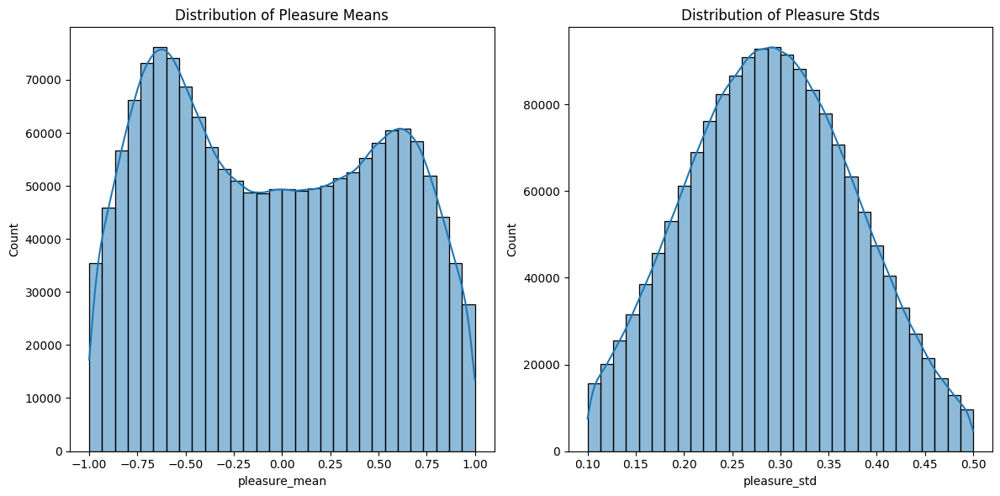
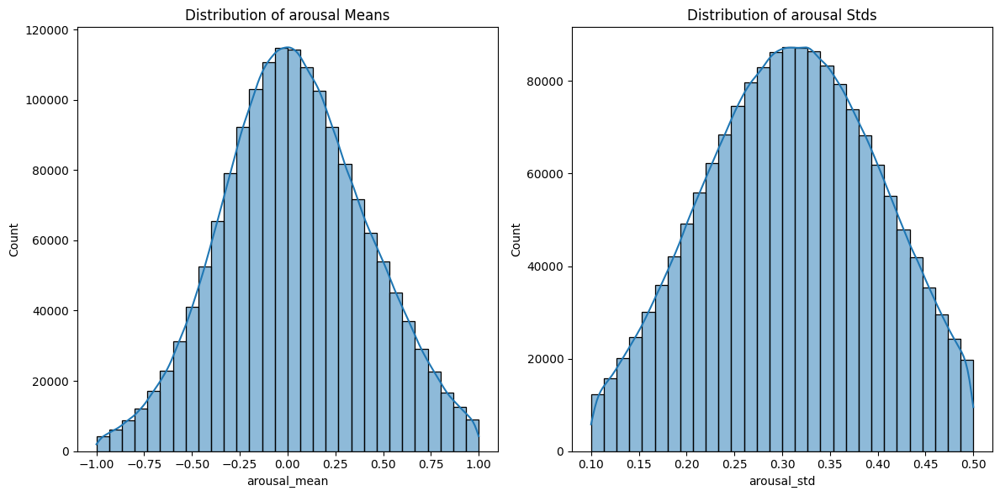
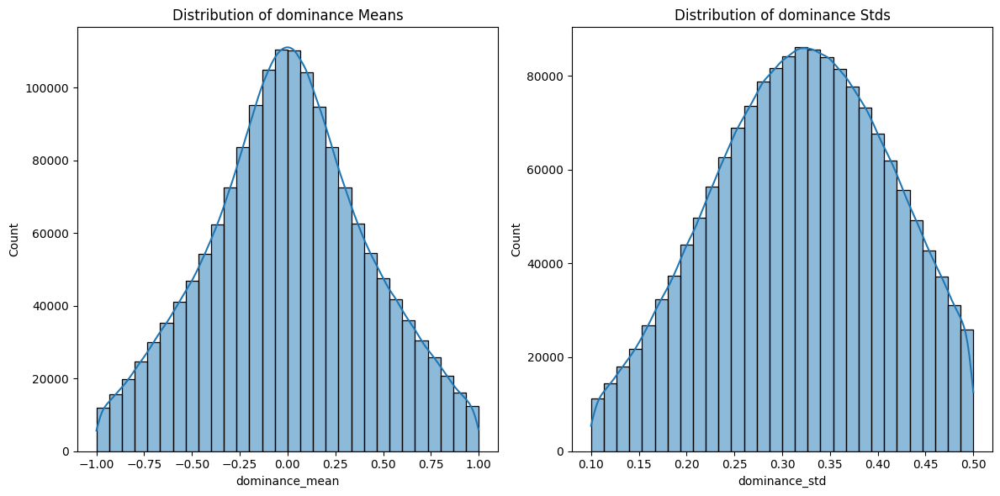
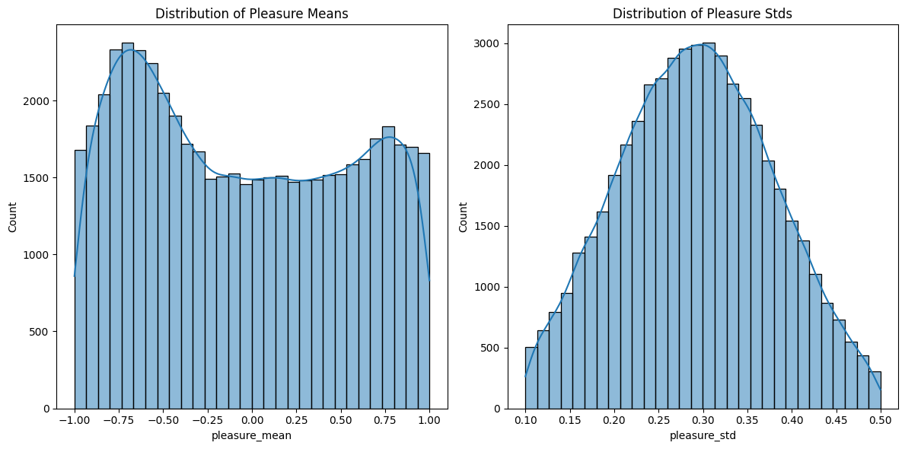
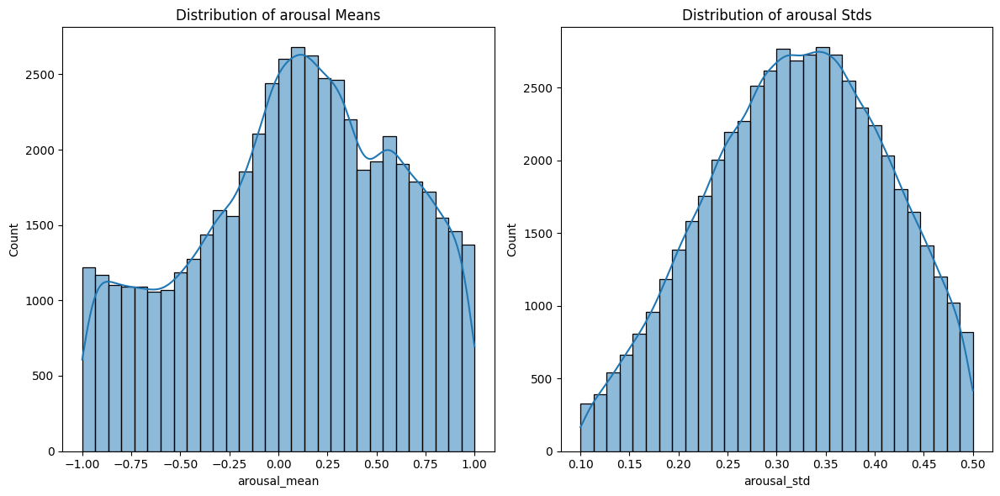
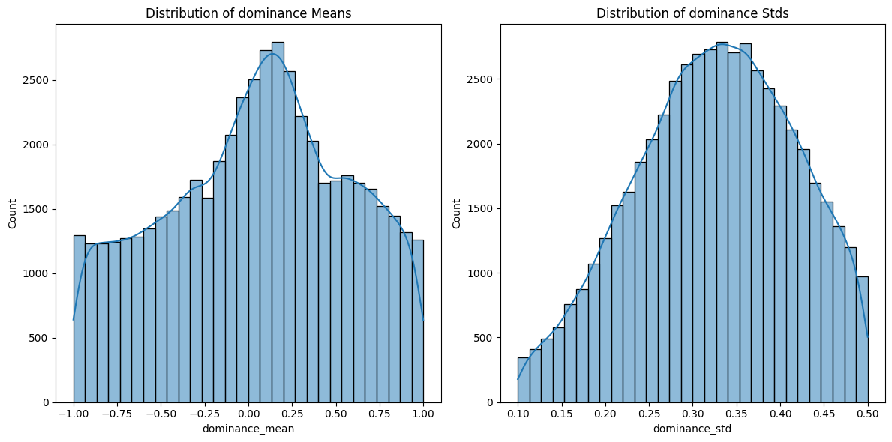

# Annotation Methodology

## Important Note
Since a large language model (LLM) was used to assist with the annotation process, all annotation results should be treated with **caution**, as errors are expected.

---

## 1. Dataset Description
The **Laion Has Talent** dataset is organized into folders with names following the pattern:

```
de_alloy_intense_anger_rage_fury_hatred_and_annoyance_vocalbursts_fixed
```

The components of the folder name are as follows:
- **Language code** (e.g., `de`) – not used in annotation.
- **Additional descriptor** (e.g., `alloy_intense`) – not used in annotation.
- **Emotion list** (e.g., `anger_rage_fury_hatred_and_annoyance`) – emotional characteristics of the audio data.
- **Other suffixes** (e.g., `vocalbursts_fixed`) – not used in annotation.

This structure is mostly consistent across the dataset.

Each folder contains paired `.mp3` audio files and `.json` annotation files with matching filenames.  
A typical JSON annotation file contains:
- **`annotation`** – structured textual description of emotional characteristics, separated by newline (`\n`).  
  Each line follows the format:  
  ```
  <Elation>1#Slight elation is present.</Elation>
  ```
  Here, the tag indicates the characteristic, the number after `#` is its value, and the text is a short description.
- **`duration`** – length of the audio file.
- **`detailed_caption`** – detailed textual description of the audio.
- **`flash_transcription`** – automatic speech recognition (ASR) result.

Some files deviate from this structure, likely due to AI annotation errors.

---

## 2. Annotation Approaches

### Variant 1 – Folder Name–Based Annotation
This is the simplest approach, based on the fact that all audio files within a folder share the same emotional category.

**Workflow:**
1. **Extract emotion labels** from the folder name using a regular expression:  
   ```
   anger_rage_fury_hatred_and_annoyance → [anger, rage, fury, hatred, annoyance]
   ```
2. **Map to a single label** using Gemma3 with the following prompt:
   ```text
   You are an assistant that helps summarize emotional labels into a single, most representative term.
   The user will provide a list of words or phrases, separated by commas. Your task is to carefully analyze the list and respond with one of the allowed labels that best captures the shared meaning or emotional essence of the entire group. Choose the most inclusive and central term.

   The allowed labels you must use for answer are the following:
   {list of allowed emotions from the original paper}

   Respond with only a single word — no explanations or additional text.
   ```
3. **Assign VAD statistics**:  
   - Use the mapped label to retrieve **Valence–Arousal–Dominance** means and standard deviations from the original table.
   - Apply these values to all `.mp3` files in the folder.

**Key idea:**  
This method forces the model to learn a general distribution of features, ignoring small file-specific nuances. Despite its simplicity, this approach was a successful in practice.

---

### Variant 2 – Sample-Based Scoring
This approach treats annotation as estimating a **distribution** rather than a fixed ground truth.

**Workflow:**
1. **Extract** the relevant description for Valence, Arousal, or Dominance from `.json` files.
2. **Convert to a score** using Gemma3. Scores range from **-1.0 to 1.0** in **0.25 increments**.  
   Example:
   - `"Slightly positive, due to his perceived power."` → `0.25`
   - `"Very calm."` → `-0.75`
   
   **Prompt:**
   ```text
   You are a helpful AI assistant. You will be provided with a short description of the emotion expressed. Your task is to determine the strength and direction of the speaker's emotion.

   The allowed descriptions and scores are:
   - Extremely negative: -1
   - Very negative: -0.75
   - Weak: -0.5
   - Slightly negative: -0.25
   - Neutral: 0
   - Slightly positive: 0.25
   - Strong: 0.5
   - Very positive: 0.75
   - Extremely positive: 1

   All generalizations must be made from the speaker's perspective, not the subject's.

   The description will be provided in the following format:
   Emotion: arousal OR valence OR dominance
   Description: <description>

   Please return only the emotion score without any additional text.
   ```
3. **(Optional)** Remap scores to a narrower range (e.g., `[-0.7, 0.7]`) to reduce the frequency of extreme values.
4. **Apply sample scoring** (described below) to generate realistic mean–std distributions.

---

#### Sample Scoring Method
The original paper provides mean and standard deviation (std) values for each emotion’s VAD distribution.  
We use these distributions to generate realistic sample-level annotations.

**Steps:**
1. **Clip extreme values**: Replace -1 and 1 with a lower threshold (e.g., 0.8 or 0.9).
2. **Sample std**:
   - Draw from a normal distribution `N(stds_mean, stds_std)`.
   - Optionally divide `stds_std` by 3 to keep values within ~68% of the original range.
   - Repeat until `0.1 < std < 0.5`. This values are choosed based on the original paper's statistics, which show that most stds fall within this range.
3. **Sample mean**:
   - Use the predicted score as the mean.
   - Sample from a normal distribution using this mean and the sampled std.
   - Ensure values remain within `[-1, 1]`; resample if necessary.

This produces distributions like:

  
  


---

## 3. Limitations
Both methods introduce noise into the data:
- **Variant 1**: Uses a rough approximation by applying the same statistics to all files in a folder.
- **Variant 2**: Introduces noise from:
  - LLM score prediction inaccuracies.
  - Additional randomness from sampling means and stds.

## 4. Balanced subset

Despite the initial value distribution appearing reasonable, the dataset suffers from a strong imbalance between edge values and central values. The absolute number of samples clustered around the center of the distribution is very large, which leads to suboptimal model performance.

To address this issue, a balanced subset was constructed by sampling values from the original dataset to achieve a more uniform distribution, particularly along the Valence and Dominance axes. This balancing improves model training by reducing bias toward neutral emotional states, encouraging better representation of extreme emotional conditions and overall better clasterization of results. The resulting distributions are shown below:

  
  


**Underlying assumptions**:
1. Each emotion’s VAD distribution should be approximately normal.
2. Sampled scores fall within the same distribution as the true values.
3. The model can learn to approximate the correct distribution from embeddings, despite noise.
